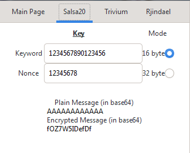
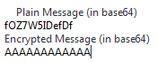
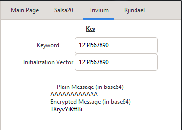
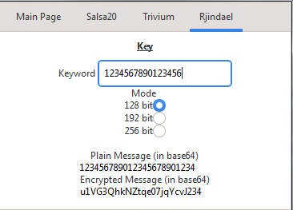
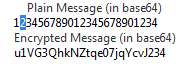
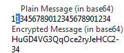

# Laborator 2 și 3 la Criptografie

A realizat: **Curmanschii Anton, IA1901**.

Întregul cod puteți găsi pe [github-ul meu](https://github.com/AntonC9018/uni_crypto).

## Sarcini

De programat următorii algoritmi de criptare și interfețele grafice mici pentru testare a lor:
1. *Salsa20*;
2. *Trivium*;
3. DES sau *AES*.


În laboratorul 1 am avut probleme cu compilarea lentă a proiectului. Am reușit să rezolv această problemă datorită utilizării lui CMake.


# Salsa80 și Trivium

Primii doi algoritmi, Salsa20 și Trivium, sunt algorimtii de criptare cu cheie fluidă: biții criptați se obțin prin executarea operației xor între biții textului clar și a cheii fluide care este generată dintr-o cheie mai mică prin procedură de expandare a cheii.

$$ e_i = m_i \oplus k_i $$

unde $e_i$ sunt biții criptați, $m_i$ sunt biții textului clar, $k_i$ biții cheii fluide.

Procedura de expandare a cheii este de fapt acel lucru care diferențiază acești algoritmi.


## Salsa80

Algoritmul operează cu un set de numere pe 4 octeți. La intrare se ia un așa numit nonce — un șir de 8 octeți care ar fi utilizat la expandare a cheii pe lângă însuși cuvântului cheie. Cuvântul cheie poate fi pe 16 sau pe 32 octeți, în dependența de modul de funcționare selectat. Am realizat ambele versiuni.

Pentru generarea biților cheii fluide, este utilizat un astfel de tablou (copiat de pe [wiki](https://www.wikiwand.com/en/Salsa20#/section_Structure)), completat din 16 (de două ori) sau din 32 octeți ai cheii, în dependența de modul selectat, 16 octeți ai unui cuvânt fixat (specificarea folosește propoziția "expand 32-byte k", un exemplu de un număr *nothing-up-my-sleeve*), 8 octeți ai lui nonce și 8 octeți pentru indicele blocului.

<table class="wikitable">
<caption>Initial state of Salsa20
</caption>
<tbody><tr>
<td data-sort-value="" style="background: #ececec; color: #2C2C2C; vertical-align: middle; text-align: center;" class="table-na">"expa"
</td>
<td style="background:#0099ff">Key
</td>
<td style="background:#0099ff">Key
</td>
<td style="background:#0099ff">Key
</td></tr>
<tr>
<td style="background:#0099ff">Key
</td>
<td data-sort-value="" style="background: #ececec; color: #2C2C2C; vertical-align: middle; text-align: center;" class="table-na">"nd 3"
</td>
<td style="background:#93db83">Nonce
</td>
<td style="background:#93db83">Nonce
</td></tr>
<tr>
<td style="background:#ff7474"><abbr title="Position">Pos.</abbr>
</td>
<td style="background:#ff7474"><abbr title="Position">Pos.</abbr>
</td>
<td data-sort-value="" style="background: #ececec; color: #2C2C2C; vertical-align: middle; text-align: center;" class="table-na">"2-by"
</td>
<td style="background:#0099ff">Key
</td></tr>
<tr>
<td style="background:#0099ff">Key
</td>
<td style="background:#0099ff">Key
</td>
<td style="background:#0099ff">Key
</td>
<td data-sort-value="" style="background: #ececec; color: #2C2C2C; vertical-align: middle; text-align: center;" class="table-na">"te k"
</td></tr></tbody></table>

Inima algoritmului constă în performarea unui set de runde pentru a expanda cheia. Fiecare rundă este împărțită în 2 jumătăți: prima efectuează operațiile descrie ulterior pe coloane, iar a două — pe rânduri. Operațiile folosite sunt sumarea, bit shiftul și xor. 

Urmează codul. Menționez că ceva tulbure mintea conceptul cu reprezentarea numerelor în formatele diferite de endianness. Adică, nu-mi era clar, cum transformările dintr-o reprezentare în altă afectează rezultatul operațiilor de sumare și rotării de biți, dar la sfârșit m-am convins că aceste operații produc același rezultat chiar dacă schimbăm modul de reprezentare binară pe o mașină ce presupune ordinea big-endian în ordinea little-endian și transformarea ulterioară înapoi în formatul nativ al mașinii. Este cam greu de explicat idea, însă am menționat lucrul acesta și cu un comentariu în cod. 

```c++
#define u32_toggle_endianness(x)	\
	(((x) << 24) | (((x) << 8) & 0xFF0000) | (((x) >> 8) & 0xFF00) | ((x) >> 24))

#define rotate_left(a,b) (((a) << (b)) | ((a) >> (32 - (b))))
#define quarter_round(a, b, c, d)(		\
	b ^= rotate_left(a + d, 7),	\
	c ^= rotate_left(b + a, 9),	\
	d ^= rotate_left(c + b,13),	\
	a ^= rotate_left(d + c,18))
#define ROUNDS 20
 

static void salsa20_block(u32 x[16])
{
	u32 array_copy[16];
    
    // If we're on a little endian machine, nothing to be done.
    // If we're on a big endian machine, we have to shift our perspective as though
    // we were on a little endian machine.
    // Little endian machines sort of do this https://stackoverflow.com/q/7184789/9731532
    // when shifting bits over bytes. Big endian machines do not do this. This is why
    // conversion between big endianness and little endianness is invertible under
    // addition and shifting, but I'm not sure if that's the right way to say it.
    // It has similar vibes to the identity in linear algebra that has to do with eigenvectors:
    // https://youtu.be/P2LTAUO1TdA?t=718

#if __BYTE_ORDER__ == __ORDER_BIG_ENDIAN__
    for (int i = 0; i < 16; i++)
    {
        x[i] = u32_toggle_endianness(x[i]);
        array_copy[i] = x[i];
    }
#else
    memcpy(array_copy, x, 16 * 4);
#endif

	// 10 loops × 2 rounds/loop = 20 rounds
	for (int i = 0; i < ROUNDS; i += 2) 
    {
		// Odd round
		quarter_round(x[ 0], x[ 4], x[ 8], x[12]);	// column 1
		quarter_round(x[ 5], x[ 9], x[13], x[ 1]);	// column 2
		quarter_round(x[10], x[14], x[ 2], x[ 6]);	// column 3
		quarter_round(x[15], x[ 3], x[ 7], x[11]);	// column 4
		// Even round
		quarter_round(x[ 0], x[ 1], x[ 2], x[ 3]);	// row 1
		quarter_round(x[ 5], x[ 6], x[ 7], x[ 4]);	// row 2
		quarter_round(x[10], x[11], x[ 8], x[ 9]);	// row 3
		quarter_round(x[15], x[12], x[13], x[14]);	// row 4
	}

	for (int i = 0; i < 16; i++)
    {
#if __BYTE_ORDER__ == __ORDER_BIG_ENDIAN__
		x[i] = u32_toggle_endianness(x[i] + array_copy[i]);
#else
        x[i] += array_copy[i];
#endif
    }

}

static void salsa20_expand16(u8 key[16], u8 nonce_and_stream_index[16], u8 keystream[64])
{
    // The constants specified by the Salsa20 specification, 'tau'
    // "expand 16-byte k"
    u8 tau[4][4] = {
        { 'e', 'x', 'p', 'a' },
        { 'n', 'd', ' ', '1' },
        { '6', '-', 'b', 'y' },
        { 't', 'e', ' ', 'k' }
    };

    /*
        Copy all of 'tau' into the correct spots in our keystream block
        
        By words, it looks like this (indices are shown):

            0  -  -  -
            -  5  -  -
            -  -  10 -
            -  -  -  15
        
        By bytes, like this:
        
            0  1  2  3  | -  -  -  -  | -  -  -  -  | -  -  -  -
            -  -  -  -  | 20 21 22 23 | -  -  -  -  | -  -  -  -
            -  -  -  -  | -  -  -  -  | 40 41 42 43 | -  -  -  -
            -  -  -  -  | -  -  -  -  | -  -  -  -  | 60 61 62 63
    */
    for (int i = 0; i < 4; i ++)
    {
        for (int j = 0; j < 4; j++)
            keystream[i * 20 + j] = tau[i][j];
    }
    /*
        Copy the key and the nonce into the keystream block.

        non is nonce
        pos is stream index

        they are concatened together in the input array.

        tau  key  key  key
        key  tau  non  non
        pos  pos  tau  key
        key  key  key  tau    

        The key positions:

        -  1  2  3
        4  -  -  -
        -  -  -  11
        12 13 14 -

        The nonce_and_stream_index positions:

        -  -  -  -
        -  -  6  7
        8  9  -  -
        -  -  -  -

        To me, this is way clearer with a memcpy.
    */
    memcpy(&keystream[ 1 * 4], key, 4 * 4); 
    memcpy(&keystream[11 * 4], key, 4 * 4); 
    memcpy(&keystream[ 6 * 4], nonce_and_stream_index, 4 * 4);

    salsa20_block((u32*)keystream);
}
```

La criptare, algoritmul folosește câte un bit din cheia fluidă la fiecare operație de xor cu biții textului clar. În total, deoarece produce câte 64 biți de cheie fluidă la fiecare expandare a cheii, o un segment al cheii poate fi folosit pentru a cripta câte 64 biți de text clar deodată.

```c++
static void salsa20_crypt(
    u8* key, u8 nonce[8], decltype(salsa20_expand32) *expand,
    u8 *input_output_buffer, u32 buffer_length)
{
    u32 stream_index = 0;
    u8 keystream[64];
    u8 nonce_and_stream_index[4 * 4];

    memcpy(nonce_and_stream_index, nonce, 8);

    // Since the stream index is a u32 (come on, it's never gonna be larger than that)
    // the upper 4 bytes, reserved for it in this array, will always be zero
    memset(&nonce_and_stream_index[12], 0, 4);

    for (u32 i = stream_index; i < buffer_length; i++) 
    {
        int keystream_index = i % 64;

        // Looped back or just started, gotta refresh the keystream
        if (keystream_index == 0) 
        {
            // Make it so that the least significant byte is the first in the word
            u32 block_number = u32_to_little_endian(i / 64);
            memcpy(&nonce_and_stream_index[8], &block_number, 4);
            (*expand)(key, nonce_and_stream_index, keystream);
        }

        // xor one byte of plaintext with one byte of keystream
        input_output_buffer[i] ^= keystream[keystream_index];
    }
}
```

### Interfața

Cum puteți observa, mesajele sunt introduse și criptate în base64. Am făcut așa, deoarece deseori caracterele primite la criptare/decriptare sunt nevalide. Însă, cum puteți vedea pe a doua imagine, algoritmul este de fapt inversabil.




Remarcă: `AAAAAAAAAA...` în base64 egalează cu un bufer nul (biții setați la 0).

### Concluzii

Acest algoritm este ușor de realizat în software, însă operațiile de conversiune între endianness sunt ceva anevoioase.

Remarcă: este foarte probabil că am greșit undeva, însă nu observ.

## Trivium

Acest algoritm este orientat pe biți. Cheia este generată printr-un algoritm care combină biții stării într-un mod aparent aleatoriu și foarte specific.

Starea se reprezintă print-o serie de 288 de biți. La fiecare iterație, se scoate câte un bit din stare și se face xor cu câte un bit din biții mesajului clar. Pentru a avansa starea, sunt utilizate operațiile de bit shift cu o poziție a întregului vector de stare, xor și and.

Însă, acest algoritm necesită un număr de iterații pentru inițializare, în care este folosit și un vector de inițializare pe lângă cuvântului cheie.

Urmează realizarea mea a algoritmului. Sunt sigut, există o realizare mai eficientă care operează cu mai multe octeți deodată.

```C++
inline u8 bit_at(u8 _byte, u32 position)
{
    return (_byte >> position) & 1;
}

inline u8 bit(u8 s[36], u32 position)
{
    u32 byte_index = position / 8;
    u8 bit_index   = position % 8;
    return bit_at(s[byte_index], bit_index);
}

inline void set_bit(u8 s[36], u32 position, u8 bit)
{
    u32 byte_index = position / 8;
    u8 bit_index   = position % 8;
    u8 byte_cleared_at_position = s[byte_index] & ((1 << bit_index) ^ 0xFF);
    s[byte_index] = byte_cleared_at_position | (bit << bit_index);
}

// Rotate bytes by an amount less than 8
inline void rotate_bytes_right(u8* _bytes, u32 num_bytes, u8 by_amount)
{
    assert(by_amount < 8);
    u8 previous_carry_over = 0;

    for (u32 i = 0; i < num_bytes; i++)
    {
        u8 carry_over = _bytes[i] >> (8 - by_amount);
        _bytes[i] = (_bytes[i] << by_amount) | previous_carry_over;
        previous_carry_over = carry_over;
    }
}

inline void rotate_state_right_by_one(u8 s[36])
{
    rotate_bytes_right(s, 36, 1);
}

static void initialize(u8 s[36], u8 key[10], u8 ivector[10])
{
    memcpy(&s[0], key, 10);
    s[10] = 0; // reset bits 80 through 88

    {
        u8 ivector_shifted_temporary[11];
        memcpy(ivector_shifted_temporary, ivector, 10);
        ivector_shifted_temporary[10] = 0;

        // Now, shift it to the right (in little endian sense) by 5
        // We will copy the result into the state at position 88, but the
        // initialization vector must end up starting at 93.
        rotate_bytes_right(ivector_shifted_temporary, 11, 5);

        // set bits up to 176
        memcpy(&s[11], ivector_shifted_temporary, 11);
    }

    // reset the rest of memory but the last byte to zeros
    memset(&s[22], 0, 13);
    // set the last 3 bits to 1
    s[35] = 0xE0;

    for (int i = 0; i < 4 * 288; i++)
    {
        u8 t1 = bit(s, 65)  ^ (bit(s, 90)  & bit(s, 91))  ^ bit(s, 92)  ^ bit(s, 170);
        u8 t2 = bit(s, 161) ^ (bit(s, 174) & bit(s, 175)) ^ bit(s, 176) ^ bit(s, 263);
        u8 t3 = bit(s, 242) ^ (bit(s, 285) & bit(s, 286)) ^ bit(s, 287) ^ bit(s, 68);

        rotate_state_right_by_one(s);
        set_bit(s, 0, t3); set_bit(s, 93, t1); set_bit(s, 177, t2);
    }
}

void trivium_crypt(u8 key[10], u8 ivector[10], u8* input_output_buffer, size_t length)
{
    u8 s[36];
    initialize(s, key, ivector);

    for (size_t i = 0; i < length; i++)
    {
        for (u8 j = 0; j < 8; j++)
        {
            u8 t1 = bit(s, 65)  ^ bit(s, 92);
            u8 t2 = bit(s, 161) ^ bit(s, 176);
            u8 t3 = bit(s, 242) ^ bit(s, 287);
            u8 key_bit = t1 ^ t2 ^ t3;

            u8 key_bit_in_correct_position = key_bit << j;
            input_output_buffer[i] = input_output_buffer[i] ^ key_bit_in_correct_position;

            t1 = t1 ^ (bit(s, 90)  & bit(s, 91))  ^ bit(s, 170);
            t2 = t2 ^ (bit(s, 174) & bit(s, 175)) ^ bit(s, 263);
            t3 = t3 ^ (bit(s, 285) & bit(s, 286)) ^ bit(s, 68);

            rotate_state_right_by_one(s);
            set_bit(s, 0, t3); set_bit(s, 93, t1); set_bit(s, 177, t2);
        }
    }
}
```

### Interfața

Iarăși, mesajul este introdus în base64.



### Concluzii

Acest algoritm este desemnat, după cum înțeleg, realizării în hardware. În software este destul de anevoios de realizat. Optimizarea algoritmului ar necesita un nivel înalt de ingeniozitate, observație și o înțelegere mai profundă a algoritmului care eu nu am.

## Concluzii la metoda criptării prin cheia fluidă

Dezavantajul principal este că fiecare octet (sau chiar bit în cazul lui Trivium) corespunde la numai un octet (bit) din șirul criptat. În algoritmul Rijndael, descris ulterior, este folosită metoda de criptare bloc, care semnificativ îmbunătățește securitatea algoritmului.


# AES (Rijndael)

*Advanced Encryption Standart* sau algoritmul *Rijndael* este un algoritm de criptare bloc care folosește aceeași cheie pentru criptare a fiecărui bloc. Însă, algoritmul diferă de la algoritmii descriși anterior prin faptul că însele blocuri de text participă în procesul de criptare, adică dacă schimbăm măcar un bit într-un bloc de text clar, aceasta va schimba aproape o jumătate a textului criptat, și invers, dacă schimbăm un bit din text criptat, acesta ar schimba aproape o jumătate a textului din blocul de text clar.

Acest algoritm a fost în special elaborat pentru:
1. a fi eficient și pe hardware și pe software;
2. a avea un nivel înalt de securitate;
3. să nu aibă nici o cheie slabă (predecesorul DES a avut chei slabe și semislabe).

## Realizare

Algoritmul utilizează operații în corpul Galois $ GF(2^8) $ pentru a asigura un nivel înalt de confuzie criptografică (dependența neliniară între biții de intrare și de ieșire). Pentru a asigura difuzia, sunt folosite operațiile de mixare a coloanelor și de shiftare a rândurilor.

Algoritmul este destul de voluminos, deci voi omit realizarea întreagă. Voi arăta numai funcțiile principale de expandare a cheii și de însăși criptare la nivel înalt. Întregul cod vedeți [aici](https://github.com/AntonC9018/uni_crypto/blob/master/src/modern/algos/rijndael.cpp).

Remarci: 
1. omit parametrizarea numărului de coloane în stare, deoarece în toate specificările a standartului AES avem 4 coloane;
2. tabelele de lookup și unele funcții am copiat de pe [aici](https://github.com/AntonC9018/AES), dar m-am asigurat că înțeleg cum ele funcționează;
3. algoritmul admite numai mesajele de o lungime divizibilă cu 16. De obicei, se face padding cu zerouri, însă nu am realizat acest lucru;
4. am realizat 4 moduri, de 11, 13 și 15 runde și cheia de lungime 128, 192 și 256 biți respectiv, cum e dat în specificare;
5. nu sunt sigur dacă operația `rotate_dword()` lucrează în același fel pe mașini cu endianness diferite. Am o impresie că ea ar roti biții în cealaltă direcție pe o mașină big-endian.

```C++
static void expand_key(AES_CYPHER_T mode, const u8* key, u8* round_keys)
{
    u32* w = (u32*)round_keys;

    // The first iteration just copies the key bytes.
    for (int i = 0; i < rijndael_key_length_in_dwords[mode]; i++)
    {
        w[i] = *(u32*)&key[i * 4];
    }

    for (int i = rijndael_key_length_in_dwords[mode]; i < 4 * (number_of_rounds[mode] + 1); i++)
    {
        u32 t = w[i - 1];

        if (i % rijndael_key_length_in_dwords[mode] == 0)
        {
            t = rotate_dword(t);
            t = sub_sbox_dword(t);
            t = t ^ rcon[i / rijndael_key_length_in_dwords[mode] - 1];
        }
        else if (rijndael_key_length_in_dwords[mode] > 6 && i % rijndael_key_length_in_dwords[mode] == 4)
        {
            t = sub_sbox_dword(t);
        }

        t = t ^ w[i - rijndael_key_length_in_dwords[mode]];
        w[i] = t;
    }
}

void rijndael_encrypt(AES_CYPHER_T mode, const u8* key, 
    u8* input_output_buffer, const size_t buffer_length)
{
    assert(buffer_length % 16 == 0);
    
    u8 round_keys[4 * 4 * 15];
    u8 state[4 * 4];

    expand_key(mode, key, round_keys);

    for (size_t i = 0; i < buffer_length / 16; i++)
    {
        for (size_t j = 0; j < 4 * 4; j++)
        {
            // Assume the length of input is a multiple of 16
            state[j] = input_output_buffer[16 * i + j] ^ round_keys[j];
        }

        for (int round = 1; round < number_of_rounds[mode]; round++)
        {
            sub_bytes(state);
            shift_rows(state);
            mix_columns(state);
            add_round_key(state, round_keys, round);
        }
        
        sub_bytes(state);
        shift_rows(state);
        
        for (size_t j = 0; j < 4 * 4; j++)
        {
            // Assume the length of input is a multiple of 16
            input_output_buffer[16 * i + j] = state[j] ^ round_keys[4 * number_of_rounds[mode] + j];
        }
    }
}
```

## Interfața



Verificăm și proprietatea de difuzie: schimbăm un caracer din șirul de intrare și observăm cum se schimbă întregul șirul de ieșire.




Algoritmul mai include mai multe moduri de generare a secvenței de ieșire: unul mai folosește un vector de inițializare, altul utilizează la criptare biții primiți anterior, etc. Eu am realizat doar cea mai simplă varianta, unde fiecare bloc este criptat independent de celelalte, însă codul pentru celelalte moduri ar fi asemănător (literalmente ar trebui să adaug 5 rânduri de cod pentru fiecare).

## Concluzii

Plusul la implementare este faptul că la criptare sunt utilizate numai operațiile pe mai multe octeți, sau în scopul octeților, dar nu între biții diferitor octeți. Acest lucru simplifică procesul de gândire referitor la faptul dacă mașina este big sau little endian.

În general, pot spune că Rijndael a obținut obiectivul său și nu degeabă a devenit standartul avansat de criptare.