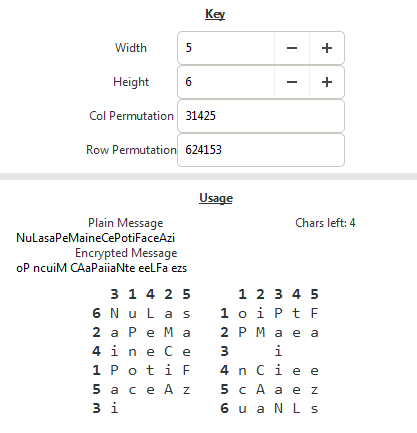
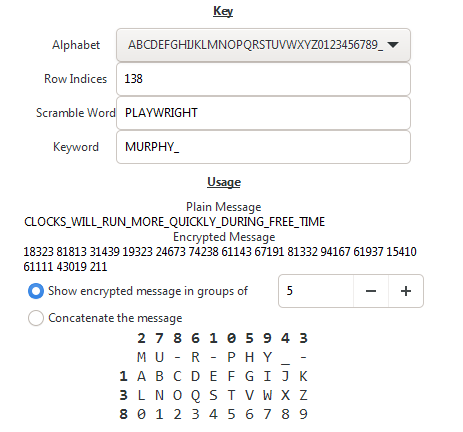
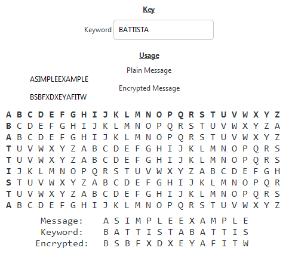

# Laborator 1


## Sarcini

1. De construit o interfață grafică pentru prezentarea unelor sisteme de criptare. Am avut varianta 2, de aceea am integrat in interfață algoritmele de criptare *cu deplasare pe rând și coloană*, *straddling checkerbox*, *vigenere* și *bazeries*.

2. De creat o descriere text a algoritmelor acestea, accesibilă din interfață.

## Instrumente

Am hotărât să realizez programul în C++, utilizând biblioteca pentru aplicații grafice **gtkmm**. Gtkmm este bazată be Gtk+ - o librarie open source, cross-platform pentru Linux, Windows și Mac, în C. 

### gtkmm

Codul din gtkmm este în mare parte autogenerat din sursele Gtk+. Însă divergența instrumentelor pentru Linux vs Windows a fost problematică pentru mine (mai detaliat pe urmă).

Pentru compilarea folosesc GNU C din MinGW (pe msys64). In tutorialul la [instalare/compilare](https://wiki.gnome.org/Projects/gtkmm/MSWindows) este menționată comanda `pkg-config gtkmm-3.0 --cflags --libs`, care îmi dă o listă de directorii cu header-uri și librării statice la care trebuie să mă link. Însă, comanda în forma dată nu dă lista corectă, deci am avut nevoie s-o modific pentru a putea compila gtkmm-ul.

Nu am folosit (cel puțin până acum) `cmake`-ul, adică îl am și chiar l-am utilizat pentru a builda unele librării, dar niciodată nu am făcut un makefile eu însumi. Acest proiect nu este o excepție: am făcut un fișier `build.bat`, unde am pus comenzile pentru build.

Documentarea recomandă utilizarea lui `autoconf` și `automake`. Nu m-am uitat la acele instrumente. Îmi pare un pic prea mult.

Documentarea gtkmm-ului este rară. Încă, ei, cum am înțeles, acum au început să treacă la o veriune nouă, a patra. Deci există două sau mai multe variante de documentare incompatibile. Aceasta m-a confundat, dar pe urmă m-am descurcat. Am folosit versiunea documentării cea veche, pentru versiunea 3, fiindcă nu am putut găsi informația cum să instalez versiunea nouă (instrucțiile pentru instalare în ambele versiuni ale documentării sunt linkate la aceeași pagină și aduc la instalarea versiunii veche). Multe chestii nu sunt deloc descrise în documentarea, însă sunt descrise destul de multe chestii ca să pot dezvolta aplicații.

De obicei o interfață este separată în trei module: layout (aka HTML), stiluri (aka CSS) și logica/scripturi (aka JavaScript). În gtkmm avem analogii — pentru layout putem folosi Glade și Pango, pentru stiluri tot se poate utiliza CSS-ul ca și pe web, iar scripturile sunt în C++.

Eu m-am vizat la ceva mai simplu — am făcut layout-ul și scripturile în C++, iar stilurile cu totul le-am omis.

Am decis să am un proces continuu, responsiv: textul criptat s-ar schimba imediat după ce se schimbă mesajul introdus, însă nu am anticipat complexitatea ce ar apărea dacă încerc să fac așa ceva fără framework-uri de tipul lui React. Am în vedere faptul că dependențele dintre diferite variabile active la un moment dat trebuie să fie stabilite manual, pe când în React dezvoltatorul nici nu trebuie să se gândească la acest lucru.

### Copilarea lentă

Una din probleme pe care le-am întâlnit era compilarea prea lentă (30+ de secunde). Cauza era că header-urile lui gtkmm sunt destul de masive (însă nu am cifre concrete). Eu compilam de fiecare dată de la zero, fiecare .cpp fișier aparte, și deci fiecare header utilizat era inclus și procesat de mai multe ori (linkarea nu lua mult timp, însuși compilarea fișierilor lua prea lung). Însă când am început să compilez toate aceste fișiere legate de gui aparte, cam în mod de mai jos, compilarea a devenit suportabilă (până la 10 secunde). S-ar putea face așa numit incremental build, însă nu știu cum să-l setez. Probabil este destul de ușor lucrul acesta în cmake. Am să studiez acest lucru cândva pe urmă.

```cpp
// main.cpp
// Toate fișierile ce utilizează gtkmm-ul, sunt incluse în main.
#include "gui/window.cpp"
#include "gui/bazeries.cpp"
#include "gui/common.cpp"
#include "gui/shift.cpp"
#include "gui/straddling.cpp"
#include "gui/vigenere.cpp"
```

### Memory leak-uri

În cursul dezvoltării, m-am dat seama de memory leak-uri. N-am idei unde am putea avea așa multe. De exemplu, după ce schimb valoarea mesajului, trebuie să recalculez valoarea mesajului criptat. Pentru acest lucru are loc un număr de alocări de memorie:

1. `TextBuffer.get_text()`, care alocă conținutul mesajului curent într-un Glib::ustring pe memorie dinamică.

2. Convertez acest șir în reprezentarea mea a șirurilor (un șir nul-terminat cu câmpul pentru lungime), utilizând `Glib::ustring.c_str()`. (Nu necesar mai facem o alocare, deoarece putem pur si simplu sa asociam șirul nou cu buferul lui Glib::ustring prin `Glib::ustring.data()`, deoarece faptul că șirul este nul-terminat nu este esențial).

3. Este inovată funcția de criptare, care returnează un șir nou, alocat pe memorie dinamică.

4. Pentru a reseta conținutul buferului cu textul criptat, se crează un `Glib::ustring` prin copierea șirului meu, deoarece funcția de setare a textului `TextBuffer.set_text()` ia ca parametru un `const Glib::ustring&`, dar nu un string_view.

Evident, eu dealoc memoria string-urilor mele cu `free()`. În acest exemplu, avem nevoie de curățat numai memoria șirului, returnat din funcția de criptare, deoarece șirurile Glib::ustring sunt dealocate automat. Însă cumva memory footprint aplicației crește cu valoarea nereală de 1MB la fiecare criptare la schimbarea mesajului și nu scade, ce este foarte suspicios.

Niciodată nu am folosit instrumente pentru găsirea memory leak-urilor. 

1. Se recomandă `Valgrand`, dar el este numai pentru Linux.

2. Mai este recomandat `UDMH`, dar el lucrează numai cu .pdb fișieri debug. .pdb este format de proprietate a lui Microsoft și este generat numai cu instrumentele Microsoft, însă eu utilizez (și probabil trebuie să utilizez) compilatorul GNU. Altfel nu pot compila gtkmm-ul.

3. Am găsit mai o opțiune: flagul `-fsanitize=leak` pentru gcc, dar el are nevoie de librărie statică lsan (Leak Sanitizer) care nu există pe Windows. Am găsit numai versiuni pentru clang, compilatorul băzat be LLVM. Însă aș dori să utilizez gcc-ul, și nu am putut găsi nimic despre cum să-l utilizez. Informația este foarte rară.

4. Am încercat doctormemory, dar el numai găsește leak-uri în însuși gtkmm-ul, dar nu în codul meu, și eu nu înțeleg cum acest program funcționează.

Deja am obosit cu debugging-ul, nu-mi place să studiez o mulțime de instrumente stranii, vreau pur și simplu să scriu cod. Studierea diferențelor dintre sisteme de operare și care librării sunt disponibile pe Windows și care nu sunt, n-am să obțin experiență în programare. Deci până când am să las așa, cu leak-uri.

#### O actualizare

Am găsit o sursă a leak-urilor și am fixat-o, dar nu era doar una. Mai am leak-uri.

# Algoritmele de criptare

## Deplasare pe rând și coloana

Vom începe cu un screenshot al interfeței.




### Câmpurile customizabile

Primele două câmpuri (Width și Height) definesc dimensiunile tabelului de criptare mai jos.

Pe urmă avem câmpurile pentru definirea permutării a rândurilor și a coloanelor în tabelul de criptare.

### Descrierea și Pseudocod

Putem cripta prin această metodă orice mesaj. Pentru lucrul acesta:

1. Scriem mesajul în ordinea rând-coloană în prima tabelă,

2. Permutăm coloanele, ca să le întoarcem în starea nepermutată (de la 1 la rând până la N). Prim urmare, primim a doua tabelă.

3. Textul criptat se obține prim citirea mesajului din tabela a doua în ordinea coloana-rând.

Matematic este și mai simplu. Dacă indicele unei litere în tabelul 1 este (i, j) - (rând, coloană reale, adică nu cele care sunt indicate în tabelă, dar poziția curentă în mesaj), indicele nou va fi (perm\[i\], perm\[j\]) - (numărul rândului și a coloanei, indicate vizual în tabel).

În pseudocod (simplificat). De menționat, că ordinea în care mesajul se înscrie în tabel se pare inversată din cauza că citirea din al doilea tabel are loc pe coloana-rând.

```
m        := mesajul de criptat, ca un char[].
perm_row := numărarea rândurilor vizuală din tabelul 1.
perm_col := numărarea coloanelor vizuală din tabelul 1.

index := 0

pentru fiecare rând row
    pentru fiecare coloană col
        m_criptat[perm_row[row] + perm_col[col] * înălțimea] = m[index]
        index++
    
return m_criptat
```

Pentru decriptare, având indicele în tabelul 2 (perm\[i\], perm\[j\]), găsim poziția lui perm\[x\] în tabelul perm pentru a găsi indicele respectiv din tabelul 1.

```
m_criptat := mesajul criptat, ca un char[].
perm_row  := numărarea rândurilor vizuală din tabelul 1.
perm_col  := numărarea coloanelor vizuală din tabelul 1.

index := 0

pentru fiecare coloană col
    pentru fiecare rând row
        new_row = find_index(perm_row, row)
        new_col = find_index(perm_col, col)
        m_decriptat[new_row * lățimea + new_col] = m[index]
        index++
    
return m_decriptat
```

### Implementarea în C++

Și iată implementarea funcțiilor date în C++. Notez, că are loc și un pic de validare, și sunt suportate mesajele de dimensiuni mai mice decât maximumul. De aceea avem `memset`-ul: funcția dată asigură că, dacă mesajul de intrare este mai mic decât maximumul, restul caracterelor este setat la spații. Încă tipul `str_t` are pointer la un șir de caractere nul terminat și lungimea acestui șir fără nulul de la sfârșit.

```cpp
namespace Shift
{
    // If a letter starts off at position x, y, it will end up at
    // row_perm[x], col_perm[y]. To go back, find the encrypted x and y
    // in these lists and take the index.
    // I'm going to represent the letters as a linear array.
    str_t encrypt(str_view_t message, const Key& key)
    {
        // The dimensions of the output message are going to be width * height of the key
        str_t encrypted = str_make(key.col_perm.size() * key.row_perm.size());
        // Fill the buffer with spaces at start.
        memset(encrypted.chars, ' ', encrypted.length);

        // Make sure the length of the message is no more than that.
        if (message.length > encrypted.length)
        {
            report_error("The message is too large. Max size for the given key is %zu, but the message had size %zu. Here it is: %s", 
                encrypted.length, message.length, message.chars);
        }

        // Fill in the spots with the characters permuted according to the key.
        size_t index = 0;
        for (size_t row = 0; row < key.row_perm.size(); row++)
        {
            for (size_t col = 0; col < key.col_perm.size(); col++, index++)
            {
                // Also transpose them
                encrypted[key.row_perm[row] + key.col_perm[col] * key.row_perm.size()] = message[index];

                if (index == message.length - 1)
                    return encrypted;
            }
        }

        return encrypted;
    }

    str_t decrypt(str_view_t encrypted, const Key& key)
    {
        // The dimensions of the output message are going to be width * height of the key
        str_t decrypted = str_make(key.col_perm.size() * key.row_perm.size());
        memset(decrypted.chars, ' ', decrypted.length);

        // May as well validate the encrypted message
        if (encrypted.length > decrypted.length)
        {
            report_error("Unexpected encrypted message length. Expected %zu, got %zu", 
                encrypted.length, decrypted.length); 
        }

        size_t index = 0;
        for (size_t col = 0; col < key.col_perm.size(); col++)
        {
            for (size_t row = 0; row < key.row_perm.size(); row++, index++)
            {
                // Find the row and the column indices in the key
                size_t new_row = find_index(key.row_perm, row);
                size_t new_col = find_index(key.col_perm, col);
                decrypted[new_row * key.col_perm.size() + new_col] = encrypted[index];
                
                if (index == encrypted.length - 1)
                    return decrypted;
            }
        }
        return decrypted;
    }
}
```


## Straddling checkerboard

Acest algoritm îmi pare cel mai complicat din setul de algoritme dat. 



### Câmpurile customizabile

Câmpul alfabet ne permite să alegem unul din două alfabete, pe caracterele din care ar putea fi format mesajul.

Câmpul Row Indices permite să alegem indicele ce vor fi utilizate la criptare prin două caractere (mai mult urmează).

Câmpul Scramble definește ordinea coloanelor din tabela. De exemplu, scramble-ul A-C-B va defini ordinea 0-2-1, după ordinea în alfabet.

Ultimul câmp, cuvântul cheie, definește ce litere vor fi criptate printr-un singur caracter (mai mult urmează).

### Descrierea și Pseudocod

Ca să înțelegem algoritmul dat, trebuie să ne dăm seama cum va arăta textul criptat. Cum putem vedea din screenshot-ul de mai jos, mesajul criptat este numeric. Trbuie să mai înțelegem un lucru: un caracter poate fi criptat în un caracter sau în două. Caracterele de pe rândul de sus (în afară liniuțelor) sunt criptate printr-o cifră, iar celelalte - prin două.

Procesul de criptare este următorul: se regăsește poziția caracterului următor din mesaj în tabel. Dacă este pe rândul de sus, caracterul este criptat printr-o cifră, indicată în tabel. Dacă nu se conține acolo, caracterul este criptat prin două cifre: numărul rândului și a coloanei (indicată în tabel).

```
m     := mesajul pentru criptare
antet := conține asocierea caracter -> indice din rândul de sus
rest  := conține asocierea caracter -> (rând, coloană) din restul tabelei

pentru fiecare caracter din m
    dacă caracter se conține în antet
        m_criptat += antet[caracter]
    altfel
        m_criptat += rest[caracter].rând
        m_criptat += rest[caracter].coloană

return m_criptat
```

Pentru decriptare avem nevioe de o asociere inversă. Cum puteți vedea în codul din C++ de mai jos, am folosit std::map pentru acest lucru, dar s-ar putea și prin regăsirea indicelor caracterilor specifice într-o tabelă bidimensională.

```
m_criptat := mesajul pentru criptat
antet     := conține asocierea indice -> caracter din rândul de sus
rest      := conține asocierea (rând, coloană) -> caracter din restul tabelei

indice := 0

până când indice < m_criptat.lungime
    cifră = m_criptat[indice]
    
    dacă cifră se conține în antet
        m_decriptat += antet[cifră]
    altfel
        indice++
        următoarea_cifră = m_criptat[indice]
        m_decriptat += rest[(cifră, următoarea_cifră)]

    indice++

return m_criptat
```

Implementarea însuși tabelului pentru asocierile date nu-l voi descrie în pseudocod.

### Implementarea în C++

Unele macro-uri și chestii sunt omise pentru simplicitate. str_builder_t funcționează în acest ca un vector de caracteri.

```cpp
namespace Straddling
{
    typedef char Header_Encrypted_Value;
    typedef std::pair<char, char> Normal_Encrypted_Value;

    struct Key
    {
        // hash maps for header and the rows
        std::map<char, Header_Encrypted_Value> encrypt_header;
        std::map<char, Normal_Encrypted_Value> encrypt_normal;
        // and mirrored decrypt pairs
        std::map<Header_Encrypted_Value, char> decrypt_header;
        std::map<Normal_Encrypted_Value, char> decrypt_normal;
    };

    Key make_key(
        str_view_t keyword,
        const std::vector<size_t>& order,
        const std::vector<size_t>& row_indices,
        str_view_t char_set,
        size_t dim
    )
    {
        auto code_positions = without(order, row_indices);
        Key key;

        for (size_t i = 0; i < code_positions.size(); i++)
        {
            if (code_positions[i] >= dim)
            {
                report_error("Height limit of %zu exceeded", dim);
            }
            key.encrypt_header[keyword[i]] = { (char)code_positions[i] };
            key.decrypt_header[{ (char)code_positions[i] }] = keyword[i];
        }

        size_t index = 0;

        for (size_t row : row_indices)
        {
            for (size_t col = 0; col < dim; col++)
            {
                if (char_set[index] == 0)
                {
                    report_error("Yikes, the char_set is not valid");
                }

                key.encrypt_normal[char_set[index]] = { row, order[col] };
                key.decrypt_normal[{ row, order[col] }] = char_set[index];
                index++;
            }
        }

        return key;
    };

    std::vector<char> encrypt(str_view_t message, const Key& key, Logger* logger)
    {
        std::vector<char> encrypted_message;
        for (size_t i = 0; i < message.length; i++)
        {
            if (in_map(key.encrypt_header, message[i]))
            {
                encrypted_message.push_back(key.encrypt_header.at(message[i]));
            }
            else if (in_map(key.encrypt_normal, message[i]))
            {
                auto val = key.encrypt_normal.at(message[i]);
                encrypted_message.push_back((char)val.first);
                encrypted_message.push_back((char)val.second);
            }
            else
            {
                logger_format_error(logger, "The character %c is not present in the dictionary.\n", message[i]);
                return encrypted_message;
            }
        }
        return encrypted_message;
    }

    str_t decrypt(const std::vector<char>& encrypted_message, const Key& key, Logger* logger)
    {
        str_builder_t decrypted = strb_make(encrypted_message.size());
        size_t i = 0;

        while (i < encrypted_message.size())
        {
            if (in_map(key.decrypt_header, encrypted_message[i]))
            {
                strb_chr(decrypted, key.decrypt_header.at(encrypted_message[i]));
            }
            else 
            {
                if (i + 1 >= encrypted_message.size())
                {
                    logger_add_error(logger, str_lit("The encrypted message is not the right length.\n"));
                    strb_free(decrypted);
                    return STR_NULL;
                }
                Normal_Encrypted_Value encrypted_key = { encrypted_message[i], encrypted_message[i + 1] };   
                if (in_map(key.decrypt_normal, encrypted_key))
                {
                    strb_chr(decrypted, key.decrypt_normal.at(encrypted_key));
                    i++;
                }
                else
                {
                    logger_format_error(logger, 
                        "The encrypted combination (%i, %i) is not present in the dictionary.\n", 
                        (int)encrypted_key.first, (int)encrypted_key.second
                    );
                    strb_free(decrypted);
                    return STR_NULL;
                }
            }
            i++;
        }
        return strb_build(decrypted);
    }
}
```

## Vigenere


### Câmpurile customizabile
### Descrierea și Pseudocod
### Implementarea în C++
